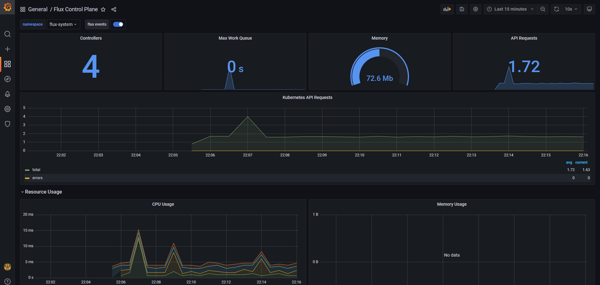

# Kube-Prometheus-Stack 



---
## Install the Flux
---
```
brew install fluxcd/tap/flux
```

```
export GITHUB_TOKEN=<YOUR_GITHUB_TOKEN>

export GITHUB_USER=<YOUR_GITHUB_USER>
```
* Check your system for flux requirements
```
flux check --pre   
```
* Run bootstrap for a Git repository and authenticate with your credentials.
```
flux bootstrap github \
  --owner=$GITHUB_USER \
  --repository=fleet-infra \
  --branch=main \
  --path=./clusters/my-cluster \
  --personal
```

## Install the Prometheus Stack

---
Registering git repository on your cluster. 

```
flux create source git flux-monitoring \
  --interval=30m \
  --url=https://github.com/fluxcd/flux2 \
  --branch=main
```
Deploy the monitoring stack kustomization:

```
flux create kustomization kube-prometheus-stack \
  --interval=1h \
  --prune \
  --source=flux-monitoring \
  --path="./manifests/monitoring/kube-prometheus-stack" \
  --health-check-timeout=5m \
  --wait
```
---
Install Flux Grafana dashboards 

```
flux create kustomization monitoring-config \
  --depends-on=kube-prometheus-stack \
  --interval=1h \
  --prune=true \
  --source=flux-monitoring \
  --path="./manifests/monitoring/monitoring-config" \
  --health-check-timeout=1m \
  --wait
```
* You can access Grafana dashboard using port-forwarding
```
kubectl -n monitoring port-forward svc/kube-prometheus-stack-grafana 3000:80
```
* You can use these default credentials to log in to the dashboard:
```
username: admin
password: prom-operator
```
* Control plane dashboard 
http://localhost:3000/d/flux-control-plane: